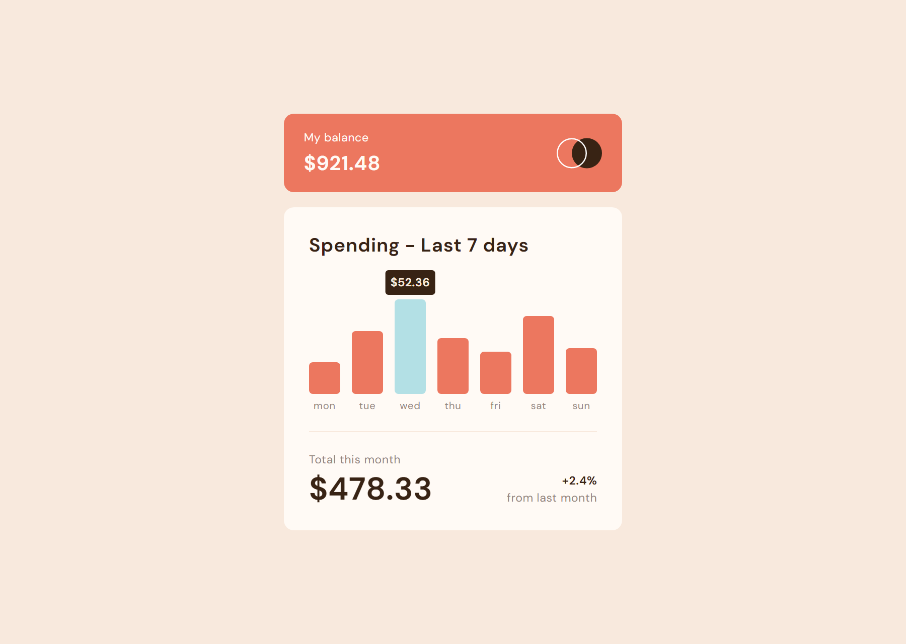

# Frontend Mentor - Expenses chart component solution

This is a solution to the [Expenses chart component challenge on Frontend Mentor](https://www.frontendmentor.io/challenges/expenses-chart-component-e7yJBUdjwt). Frontend Mentor challenges help you improve your coding skills by building realistic projects. 

## Table of contents

- [The challenge](#the-challenge)
- [Screenshot](#screenshot)
- [Links](#links)
- [Useful resources](#useful-resources)
- [Author](#author)

### The challenge

Users should be able to:

- View the bar chart and hover over the individual bars to see the correct amounts for each day
- See the current day’s bar highlighted in a different colour to the other bars
- View the optimal layout for the content depending on their device’s screen size
- See hover states for all interactive elements on the page
- **Bonus**: Use the JSON data file provided to dynamically size the bars on the chart

## Screenshot

## Links

- Solution URL: [GitHub Repository](https://github.com/joangute/expenses-chart/)
- Live Site URL: [GitHub Pages](https://joangute.github.io/expenses-chart/)

## Useful resources

- [MDN Web Docs](https://developer.mozilla.org/en-US/docs/Learn/JavaScript/Objects/JSON) - This helped me to implement the asynchronous function in javascript.
- [Stackoverflow](https://stackoverflow.com/) - As always I found here good answers about code.

## Author

- Frontend Mentor - [@joangute](https://www.frontendmentor.io/profile/joangute)